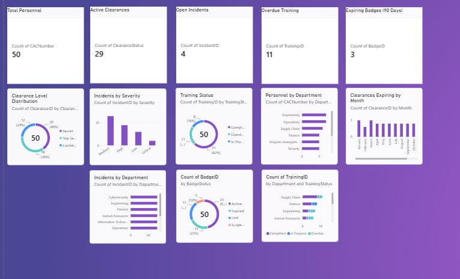

Author
Kesha Scott
Data | Database | Business Systems Engineering | Power BI | SQL | Python
# Personnel Security Analytics Dashboard

## Dashboard Preview

  

A Power BI personnel security dashboard built with Python-generated data, Power Query, and a relational data model.

This project demonstrates how personnel, clearance, incident, training, and badge-access data can be organized into a clean analytical model and transformed into an executive-level security dashboard.

> **Note:** All data in this project is fictional and was created specifically for portfolio and demonstration purposes. No real employee, CAC, clearance, security incident, or classified information is used.

---

## Project Overview

The goal of this project was to build a realistic personnel security reporting solution similar to the type of dashboard that could support a defense contractor, security department, or regulated organization.

The solution tracks:

- Personnel
- Security clearances
- Security incidents
- Security training
- Badge and facility access
- Clearance expiration dates
- Badge expiration dates
- Training compliance
- Incident severity
- Department-level security trends

The dashboard allows security leadership to quickly identify areas requiring attention and monitor personnel security readiness across the organization.

---

## Technologies Used

- **Power BI Desktop**
- **Power Query**
- **Python**
- **Pandas**
- **CSV data sources**
- **Relational data modeling**
- **Data validation**
- **Git / GitHub**

---

## Data Architecture

The solution uses a relational model centered around the `People` table.

`CACNumber` serves as the unique personnel identifier and primary key in the People table.

Each supporting table connects back to the People table through `CACNumber`.

```text
                     People
                  CACNumber
                      1
                      |
        --------------------------------
        |              |              |
        *              *              *
    Clearance       Incidents       Training
        |
        *
   Badge Access
The Power BI model uses a cleaner star-style structure:
people[CACNumber]
      1
      |
      +------ * clearance[CACNumber]
      |
      +------ * incidents[CACNumber]
      |
      +------ * training[CACNumber]
      |
      +------ * badge_access[CACNumber]
Cross-filter direction is configured as Single, with the People table acting as the primary personnel dimension.
People Table
The People table contains the core personnel information used throughout the model.
Key fields include:
•	CACNumber 
•	FirstName 
•	LastName 
•	PreferredName 
•	HireDate 
•	EmploymentStatus 
•	Department 
•	Division 
•	JobTitle 
•	WorkLocation 
•	ManagerCode 
•	EmployeeType 
•	Program 
The dataset includes 50 fictional personnel records.
________________________________________
Clearance Table
The Clearance table tracks personnel security eligibility and clearance information.
Key fields include:
•	ClearanceID 
•	CACNumber 
•	ClearanceLevel 
•	ClearanceStatus 
•	IssueDate 
•	ExpirationDate 
•	LastReviewDate 
•	NextReviewDate 
•	EligibilityStatus 
•	AccessStatus 
•	ContinuousVetting 
Clearance levels include:
•	Confidential 
•	Secret 
•	Top Secret 
The dashboard can be used to identify active, pending, suspended, and expiring clearances.
________________________________________
Security Incidents Table
The Incidents table tracks fictional personnel security events.
Key fields include:
•	IncidentID 
•	CACNumber 
•	IncidentType 
•	Severity 
•	IncidentDate 
•	ReportedDate 
•	Status 
•	CorrectiveActionRequired 
•	RepeatIncident 
Example incident types include:
•	Lost Badge 
•	Security Violation 
•	Unauthorized Area Access 
•	Improper Document Handling 
•	Foreign Travel Reporting 
•	Information Handling 
•	Tailgating 
•	Policy Violation 
•	Suspicious Email Reporting 
•	Device Loss 
Severity levels include:
•	Critical 
•	High 
•	Medium 
•	Low 
________________________________________
Training Table
The Training table tracks personnel security training and compliance.
Key fields include:
•	TrainingID 
•	CACNumber 
•	TrainingType 
•	AssignedDate 
•	DueDate 
•	TrainingStatus 
•	Score 
Training categories include:
•	Annual Security Awareness Training 
•	Insider Threat Awareness 
•	Cybersecurity Awareness 
•	Controlled Unclassified Information (CUI) Training 
•	Foreign Travel Security Training 
Training status includes:
•	Completed 
•	In Progress 
•	Overdue 
________________________________________
Badge and Access Table
The Badge Access table tracks employee badge and facility access information.
Key fields include:
•	BadgeID 
•	CACNumber 
•	BadgeStatus 
•	BadgeIssueDate 
•	BadgeExpirationDate 
•	AccessLevel 
•	Facility 
•	LastAccessReviewDate 
Badge statuses include:
•	Active 
•	Suspended 
•	Expired 
•	Lost 
________________________________________
Data Generation
The project data was generated using Python and Pandas.
Python was used to:
•	Create fictional personnel records 
•	Assign departments and divisions 
•	Generate job titles 
•	Assign work locations 
•	Generate program assignments 
•	Create security clearance records 
•	Generate clearance dates 
•	Create security incident records 
•	Generate security training records 
•	Create badge and facility-access records 
Example:
people["Department"] = random.choices(
    departments,
    k=50
)
The generated datasets were exported to CSV and loaded into Power BI.
________________________________________
Data Validation
Before importing the data into Power BI, Python validation checks were performed.
Validation included:
•	Duplicate CAC numbers 
•	Missing CAC numbers 
•	Invalid foreign keys 
•	Unique personnel count 
•	Row counts for each dataset 
Example validation results:
People: 50
Clearance: 50
Incidents: 30
Training: 50
Badge / Access: 50

Duplicate CAC numbers in People:
0

Missing CAC numbers:
People: 0
Clearance: 0
Incidents: 0
Training: 0
Badge / Access: 0

Invalid CAC numbers:
Clearance: 0
Incidents: 0
Training: 0
Badge / Access: 0

Unique people:
50
This ensures that all foreign-key relationships correctly reference a valid person.
________________________________________
Power Query
Power Query was used to prepare the data before loading it into the Power BI model.
Transformations included:
•	Setting appropriate data types 
•	Converting date/time values to dates 
•	Cleaning text fields 
•	Verifying identifier columns 
•	Preparing tables for relationship modeling 
Examples:
CACNumber       → Whole Number
HireDate        → Date
Department      → Text
TrainingID      → Whole Number
IncidentDate    → Date
ExpirationDate  → Date
________________________________________
Power BI Data Model
The model uses the People table as the primary dimension.
Relationships:
people[CACNumber] 1 → * clearance[CACNumber]

people[CACNumber] 1 → * incidents[CACNumber]

people[CACNumber] 1 → * training[CACNumber]

people[CACNumber] 1 → * badge_access[CACNumber]
This design allows security information to be analyzed by:
•	Department 
•	Division 
•	Employee 
•	Program 
•	Location 
•	Manager 
________________________________________
Dashboard KPIs
The dashboard includes executive-level KPI cards for:
•	Total Personnel 
•	Active Clearances 
•	Open Incidents 
•	Overdue Training 
•	Expiring Badges Within 90 Days 
Example dashboard metrics:
Total Personnel              50
Active Clearances            29
Open Incidents                4
Overdue Training             11
Expiring Badges (90 Days)     3
________________________________________
Dashboard Visualizations
The dashboard contains several analytical visuals.
Clearance Level Distribution
Displays personnel by:
•	Confidential 
•	Secret 
•	Top Secret 
Incidents by Severity
Shows security incidents categorized by:
•	Critical 
•	High 
•	Medium 
•	Low 
Training Status
Displays:
•	Completed 
•	In Progress 
•	Overdue 
Personnel by Department
Shows workforce distribution across organizational departments.
Clearances Expiring by Month
Highlights upcoming clearance expiration activity.
Incidents by Department
Allows security leadership to identify organizational areas with higher incident activity.
Badge Status
Displays:
•	Active 
•	Suspended 
•	Expired 
•	Lost 
Training Compliance by Department
Shows training status across departments using completed, in-progress, and overdue categories.
________________________________________
Key Skills Demonstrated
This project demonstrates experience with:
•	Power BI dashboard development 
•	Power Query 
•	Python data generation 
•	Pandas 
•	Data modeling 
•	Primary and foreign keys 
•	Star-schema concepts 
•	Data validation 
•	Data cleansing 
•	Relationship management 
•	KPI development 
•	Security analytics 
•	Business intelligence 
•	Data visualization 
•	Executive reporting 
•	Requirements-driven dashboard design 
________________________________________
Repository Structure
Personnel-Security-PowerBI-Dashboard/
│
├── README.md
├── security_data.py
│
├── data/
│   ├── people.csv
│   ├── clearance.csv
│   ├── incidents.csv
│   ├── training.csv
│   └── badge_access.csv
│
├── screenshots/
│   └── dashboard-overview.png
│
└── powerbi/
    └── PersonnelSecurityDashboard.pbix
________________________________________
Dashboard Preview
Add a screenshot of the completed dashboard here:

________________________________________
Live Dashboard
A public Power BI demonstration link can be added here:
[View the Interactive Power BI Dashboard](PASTE-YOUR-POWER-BI-LINK-HERE)
________________________________________
Business Value
This dashboard demonstrates how multiple personnel-security datasets can be integrated into a single analytical solution.
A security team could use a similar solution to:
•	Monitor clearance readiness 
•	Identify upcoming clearance renewals 
•	Track personnel security incidents 
•	Monitor training compliance 
•	Review badge and facility access 
•	Identify department-level security trends 
•	Support management reporting and decision-making 
________________________________________
Future Enhancements
Potential future improvements include:
•	Row-level security 
•	Automated data refresh 
•	SQL Server backend integration 
•	Additional DAX measures 
•	Risk-scoring calculations 
•	Incident trend analysis 
•	Clearance renewal alerts 
•	Drill-through employee profiles 
•	Role-based security views 
•	Power BI Service deployment 
•	Automated Python-to-database data pipeline 
## Python Skill Development

One of my goals for this project was to strengthen my hands-on Python skills.

My background is heavily focused on databases, SQL, application development, and business systems. I wanted to expand that experience by using Python as part of a complete data analytics workflow rather than only learning Python syntax in isolation.

For this project, I used Python and Pandas to build and validate the source datasets that power the Power BI dashboard.

### Python Skills Demonstrated

Through this project, I worked with:

- Python variables and data structures
- Lists and dictionaries
- `for` loops and list comprehensions
- Conditional data assignment
- Randomized test-data generation
- Pandas DataFrames
- Creating and modifying DataFrame columns
- Filtering rows with `.loc`
- Mapping values between related business categories
- Working with dates using Pandas
- Generating date ranges
- Creating primary and foreign key values
- Exporting DataFrames to CSV
- Reading CSV files back into Python
- Validating row counts
- Detecting duplicate keys
- Checking for missing values
- Validating foreign-key relationships
- Organizing Python code in Visual Studio Code

### Example: Relational Data Generation

The People dataset uses `CACNumber` as the unique personnel identifier.

Supporting datasets reference the same identifier:

```python
clearance["CACNumber"] = people["CACNumber"]

incident["CACNumber"] = random.choices(
    people["CACNumber"].tolist(),
    k=30
)

training["CACNumber"] = random.choices(
    people["CACNumber"].tolist(),
    k=50
)
This allowed me to generate multiple related datasets while preserving the relationships required by the Power BI data model.
Example: Business Logic
Instead of assigning completely random organizational information, I used Python dictionaries to maintain logical relationships between data.
division_map = {
    "Cybersecurity": "Cyber Operations",
    "Information Technology": "Enterprise Technology",
    "Engineering": "Mission Systems",
    "Security": "Security Operations",
    "Operations": "Program Operations",
    "Program Management": "Program Operations",
    "Quality Assurance": "Mission Assurance",
    "Human Resources": "Corporate Services",
    "Finance": "Corporate Services",
    "Supply Chain": "Program Operations"
}

people["Division"] = people["Department"].map(division_map)
This made the generated dataset more realistic while reinforcing my understanding of data transformation and business rules.
Example: Data Validation
I also used Python to validate the datasets before importing them into Power BI.
valid_cacs = set(people["CACNumber"])

print(
    (~clearance["CACNumber"].isin(valid_cacs)).sum()
)

print(
    (~incident["CACNumber"].isin(valid_cacs)).sum()
)

print(
    (~training["CACNumber"].isin(valid_cacs)).sum()
)
The validation process confirmed:
•	50 unique personnel records 
•	No duplicate personnel CAC numbers 
•	No missing CAC numbers 
•	No invalid foreign-key CAC numbers 
•	Valid relationships across all five datasets 
Skills Growth
This project represents practical growth in my Python skill set.
Rather than treating Python as a standalone programming exercise, I used it as part of an end-to-end data

